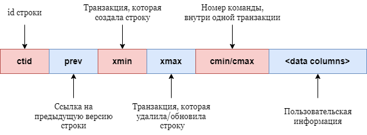
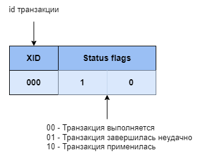

# 6. Управление транзакциями в СУБД PostgreSQL

### Цель работы

Ознакомление с механизмами изоляции транзакций при параллельном выполнении запросов к одним и тем же данным
на различных уровнях изоляции с использованием блокировок и многоверсионности. Получение навыков работы с СУБД PostgreSQL.

### Теоретические сведения

Предварительно ознакомиться: [материалы лекции по изоляции транзакций](https://aksenov.in/guap/db/lectures/doku.php?id=lectures:lecture5)

#### Виды аномалий:

_Грязное чтение_ (dirty read) - одна транзакция (T1) видит изменения, которые происходят в другой параллельно выполняющейся,
незавершенной транзакции (T2).
В данном случае транзакция (T1) может увидеть состояние, в котором база данных никогда не находилась,
так как может произойти отмена транзакции (T2) и все её изменения не будут применены. 

_Потерянное обновления_ (lost update) - возникает, когда две транзакции читают одну и ту же строку таблицы,
затем одна из них обновляет эту строку, после чего вторая обновляет эту же строку, не учитывая изменений,
сделанных первой транзакцией.

_Неповторяющееся чтение_ (nonrepeatable read) - возникает, когда
транзакция (T1) читает одну и ту же строку два раза, а в промежутке между чтениями другая транзакция (T2) изменяет (или удаляет) эту строку и фиксирует
изменения. Тогда транзакция (T1) получит разные результаты.

_Фантомное чтение_ (phantom read) - возникает, когда одна транзакция два раза читает набор строк по одинаковому условию,
а в промежутке между чтениями другая транзакция добавляет, удаляет строки, удовлетворяющие
этому условию, и фиксирует изменения. В следствии первая транзакция получает
разные наборы строк.


#### Многоверсионность (MVCC, Multi-Versioned Concurrency Control)
MVCC - паттерн проектирования, который применятся в транзакционных системах. 
Данный паттерн базируется на предоставлении каждой транзакции копию (snapshot) данных, которые гарантированно будут являться целостными (Consistency).
При таком подходе удается избежать блокировок транзакций, которые читают данные, так как они используют копию.

#### MVCC в PostgreSQL
В СУБД PostgreSQL идея версионирования реализована на уровне строк таблиц.
Каждой строке в PostgreSQL присваиваются дополнительные значения, которые позволяют контролировать версии строки.



Также в PostgreSQL логгирует данные транзакций, в директории pg_xact (до версии PostgresSQL 10, pg_clog).
При помощи данной функциональности можно отследить номер транзакции и статус её выполнения.



#### Уровни изоляции транзакций в PostgreSQL

| **Уровень изоляции**                               | "Грязное" чтение              | Неповторяемое чтение | Фантомное чтение              | Аномалия сериализации |
|----------------------------------------------------|-------------------------------|----------------------|-------------------------------|-----------------------|
| Read uncommitted (Чтение незафиксированных данных) | Допускается, но не в Postgres | Возможно             | Возможно                      | Возможно              |
| Read committed (Чтение зафиксированных данных)     | Невозможно                    | Возможно             | Возможно                      | Возможно              |
| Repeatable read (Повторяемое чтение)               | Невозможно                    | Невозможно           | Допускается, но не в Postgres | Возможно              |
| Serializable (Сериализуемость)                     | Невозможно                    | Невозможно           | Невозможно                    | Невозможно            |

В Postgres режим Read uncommitted работает как Read committed.
Связано это с тем, что это единственный разумный способ сопоставить стандартные уровни изоляции
с реализованной в Postgres архитектурой управления параллельным доступом посредством многоверсионности (MVCC, Multi-Versioned Concurrency Control)

#### Уровень изоляции Read Committed
_Read committed_ - уровень изоляции транзакции, используемый в Postgres по умолчанию.
При использовании данного уровня изоляции запросы SELECT увидят только те данные,
которые были зафиксированы до начала запроса. Другие транзакции могут изменять данные, и если транзакция повторно считывает те же данные,
она может увидеть изменения, произведенные другими транзакциями после начала чтения.
Добавления, изменения или удаления данных, при данном уровне изоляции могут быть отложены,
если параллельные транзакции изменят, удалят, заблокируют данные
и в данном случае первая транзакция будет ожидать применения или отката изменений в параллельных транзакциях.

#### Уровень изоляции Repeatable Read
_Repeatable Read_ - данный уровень изоляции может считывать данные на момент начала транзакции.
На протяжении всей транзакции не будут видны изменения, которые были внесены другими параллельными транзакциями.
Если параллельная транзакция изменит, удалит, заблокирует целевые данные, 
транзакция в режиме Repeatable Read будет ожидать фиксирования или отката параллельной транзакции.
В случае если параллельная транзакция завершится неудачей, то текущая Repeatable Read транзакция сможет продолжить свою работу.
Если же первая транзакция зафиксировалась и в результате изменила или удалила эту строку, а не просто заблокировала её, произойдёт откат текущей транзакции.

#### Уровень изоляции Serializable
_Serializable_ - данный уровень изоляции обеспечивает наиболее строгую изоляцию и гарантирует,
что транзакции будут выполняться так, как если бы они были последовательными, даже при параллельном выполнении.
В остальном данный уровень изоляции схож с Repeatable Read.

Чтобы задать требуемый уровень изоляции, нужно использовать следующие команды:

```sql
SET TRANSACTION ISOLATION LEVEL { SERIALIZABLE | REPEATABLE READ | READ COMMITTED | READ UNCOMMITTED } -- Для установки уровня изоляции последующей транзакции

SET SESSION CHARACTERISTICS AS TRANSACTION ISOLATION LEVEL { SERIALIZABLE | REPEATABLE READ | READ COMMITTED | READ UNCOMMITTED } -- Для всех последующих транзакций данного подключения

BEGIN ISOLATION LEVEL { SERIALIZABLE | REPEATABLE READ | READ COMMITTED | READ UNCOMMITTED } -- Открытие транзакции с установленным для неё уровнем изоляции
    
--Например:

BEGIN ISOLATION LEVEL READ COMMITTED   
```

#### Явные блокировки в PostgreSQL
В PostgreSQL имеется возможность установить явные блокировки на данные внутри транзакции,
используя ключевые слова "FOR UPDATE" или "FOR SHARE" в операторе SELECT.
```sql
SELECT * FROM table FOR UPDATE; -- Установка режима блокировки FOR UPDATE
```
Режим блокировки "FOR UPDATE" является исключающим режимом. Используется для строк с их последующим обновлением,
при это режиме блокировки параллельные транзакции не смогут модифицировать или заблокировать эти строки до окончания текущей транзакции.

```sql
SELECT * FROM table FOR SHARE; -- Установка режима блокировки FOR SHARE
```
Режим блокировки "FOR SHARE" является разделяемым режимом. Используется когда необходимо прочитать строки, но при этом не допуская,
чтобы они как-либо изменились другой транзакцией.

Разница между исключительной и разделяющей блокировкой заключается в том,
что в случая с исключающим режимом, другие транзакции не могут устанавливать никакие блокировки на эти строки,
в то время как разделяемые режимы допускают некоторые блокировки в параллельных транзакциях.

#### Точки сохранения в PostgreSQL
Для транзакций, выполняющих большие объемы работы, может быть целесообразно использовать точки сохранения при помощи оператора SAVEPOINT,
который запоминает состояние всех данных, измененных транзакцией к моменту его выполнения.
В случае если при продолжении выполнения транзакции обнаруживается ошибка, можно восстановить состояние базы данных,
выполняя операцию ROLLBACK TO с указанием имени того состояния, которое было предварительно записано оператором SAVEPOINT.
Если необходимо уничтожить точку сохранения, сохраняя изменения, произведённые после того, как она была установлена, применяется команда RELEASE SAVEPOINT.
Данный механизм выгоден, когда транзакция выполняет ресурсозатратные операции, потеря которых нежелательна.

### Рекомендации по выполнению лабораторной работы
Задания выполняются с использованием сервера PostgreSQL версии 9.5 или выше.
В версиях ниже отсутствует реализация уровня изоляции Repeatable Read.
В качестве клиента можно использовать поставляемую с сервером утилиту командной строки psql, либо графический интерфейс
pgAdmin. При использовании ПО с графическим интерфейсом пользователя задания выполняются в окне редактора SQL-запросов.

При выполнении лабораторной работы необходимо отключить режим автофискации (autocommit).
Для его отключения можно прописать следующую команду внутри интерактивного терминала psql:

```\set AUTOCOMMIT off```

Для проверки текущего режима автофискации можно ввести следующую команду:
```\echo :AUTOCOMMIT```


Параллельно запускаются две транзакции из двух открытых подключений. Первая транзакция T1 (из подключения с уровнем изоляции согласно варианту) производит операции с данными, после чего вторая транзакция T2 также работает с этими данными и так далее. Список действий должен полностью представлять реакцию системы на зависимости между транзакциями.


Для каждого варианта необходимо продемонстрировать работу явной блокировки "FOR UPDATE", оператора SAVEPOINT,
а также проанализировать следующие аномалии:

1. Зависимость потерянного обновления

        |    T1   |    T2    |
        |:-------:|:--------:|
        | read(x) |          |
        |         | write(x) |
        | write(x)|          |

2. Зависимость неповторяемого чтения

        |    T1   |    T2    |
        |:-------:|:--------:|
        | read(x) |          |
        |         | write(x) |
        | read(x) |          |

3. Зависимость фантомов

        |     T1    |   T2   |
        |:---------:|:------:|
        | filter(t) |        |
        |           | add(t) |
        | filter(t) |        |

### Пример 1

Режимы изоляции READ COMMITTED (таблица - 1) и REPEATABLE READ (таблица - 2), зависимость потерянного обновления

<table>
    <tr>
        <th>T1</th>
        <th>T2</th>
    </tr>
    <tr>
        <td>
            <pre>
BEGIN ISOLATION LEVEL READ COMMITTED;  
SELECT * FROM t WHERE i = 3;
+------+
|&nbsp;i&nbsp;&nbsp;&nbsp;&nbsp;|
+------+
|&nbsp;&nbsp;&nbsp;&nbsp;3&nbsp;|
+------+
(1 строка)
            </pre>
        </td>
        <td></td>
    </tr>
    <tr>
        <td></td>
        <td>
            <pre>
BEGIN ISOLATION LEVEL READ COMMITTED; 
UPDATE t SET i=3 WHERE i=2;
UPDATE 1
            </pre>
        </td>
    </tr>
    <tr>
        <td>
            <pre>
UPDATE t SET i=5 WHERE i=2;
            </pre>
        </td>
        <td></td>
    </tr>
    <tr>
        <td>
            <pre>
Ожидание
            </pre>
        </td>
        <td></td>
    </tr>
    <tr>
        <td></td>
        <td>
            <pre>
COMMIT;
            </pre>
        </td>            
    </tr>
<tr>
        <td>
            <pre>
UPDATE 0
            </pre>
        </td>
        <td></td>
    </tr>
</table>


<table>
    <tr>
        <th>T1</th>
        <th>T2</th>
    </tr>
    <tr>
        <td>
            <pre>
BEGIN ISOLATION LEVEL REPEATABLE READ;
SELECT * FROM t WHERE i = 3;
+------+
|&nbsp;i&nbsp;&nbsp;&nbsp;&nbsp;|
+------+
|&nbsp;&nbsp;&nbsp;&nbsp;3&nbsp;|
+------+
(1 строка)
            </pre>
        </td>
        <td></td>
    </tr>
    <tr>
        <td></td>
        <td>
            <pre>
BEGIN ISOLATION LEVEL REPEATABLE READ;
UPDATE t SET i=3 WHERE i=2;
UPDATE 1
            </pre>
        </td>
    </tr>
    <tr>
        <td>
            <pre>
UPDATE t SET i=5 WHERE i=2;
            </pre>
        </td>
        <td></td>
    </tr>
    <tr>
        <td>
            <pre>
Ожидание
            </pre>
        </td>
        <td></td>
    </tr>
    <tr>
        <td></td>
        <td>
            <pre>
COMMIT;
            </pre>
        </td>            
    </tr>
<tr>
        <td>
            <pre>
ОШИБКА: не удалось сериализовать доступ
из-за параллельного изменения
            </pre>
        </td>
        <td></td>
    </tr>
</table>

Вывод: потерянное обновление не допускается в режиме REPEATABLE READ, в отличие от режима READ COMMITTED.
При режиме REPEATABLE READ транзакция (T1) пытается изменить данные, которые уже были изменены параллельной транзакцией (T2),
из-за чего попадает в ожидание. Так как транзакция (T2) успешно применилась, транзакция (T1) завершилась с ошибкой.
Если бы произошёл откат транзакции (T2), то транзакция (T1) успешно изменила бы данные, после чего могла бы совершить commit.
При режиме READ COMMITTED транзакция (T1) пытается изменить данные, которые уже были изменены параллельной транзакцией (T2),
из-за чего попадает в ожидание. После применения изменений транзакцией (T2), транзакция (T1) также применяет свои изменения.

### Пример 2

Исследование явной блокировки "FOR UPDATE" уровень READ COMMITTED.

<table>
    <tr>
        <th>T1</th>
        <th>T2</th>
    </tr>
    <tr>
        <td>
            <pre>
BEGIN ISOLATION LEVEL READ COMMITTED;
SELECT * FROM t WHERE i = 3 FOR UPDATE; 
+------+
|&nbsp;i&nbsp;&nbsp;&nbsp;&nbsp;|
+------+
|&nbsp;&nbsp;&nbsp;&nbsp;3&nbsp;|
+------+
(1 строка)
            </pre>
        </td>
        <td></td>
    </tr>
    <tr>
        <td></td>
        <td>
            <pre>
BEGIN ISOLATION LEVEL READ COMMITTED; 
UPDATE t SET i = 5 WHERE i = 2;
            </pre> 
        </td>
    </tr>
    <tr>
        <td></td>
        <td>
            <pre>
Ожидание...
            </pre> 
        </td>
    </tr>
    <tr>
        <td>
            <pre>
UPDATE t SET i = 1 WHERE i = 2;
COMMIT;
            </pre>
        </td>
        <td></td>
    </tr>
    <tr>
        <td></td>
        <td>
            <pre>
UPDATE 0;
            </pre>
        </td>            
    </tr>
</table>

### Пример 3

Анализ работы оператора SAVEPOINT.

<table>
    <tr>
        <th>T</th>
    </tr>
    <tr>
        <td>
            <pre>
BEGIN ISOLATION LEVEL READ COMMITTED;
SELECT * FROM t;
+------+
|&nbsp;i&nbsp;&nbsp;&nbsp;&nbsp;|
+------+
|&nbsp;&nbsp;&nbsp;&nbsp;3&nbsp;|
+------+
|&nbsp;&nbsp;&nbsp;&nbsp;2&nbsp;|
+------+
(2 строки)
            </pre>
        </td>
    </tr>
    <tr>
        <td>
            <pre>
UPDATE t SET i = 10 WHERE i = 2;
UPDATE 1
            </pre>
        </td>
    </tr>
    <tr>
        <td>
            <pre>
SELECT * FROM t;
+------+
|&nbsp;i&nbsp;&nbsp;&nbsp;&nbsp;|
+------+
|&nbsp;&nbsp;&nbsp;&nbsp;3&nbsp;|
+------+
|&nbsp;&nbsp;&nbsp;10&nbsp;|
+------+
(2 строки)
            </pre>
        </td>
    </tr>
    <tr>
        <td>
            <pre>
SAVEPOINT svp;
SAVEPOINT
            </pre>
        </td>
    </tr>
    <tr>
        <td>
            <pre>
DELETE FROM t WHERE i = 10;
DELETE 1
SELECT * FROM t;
+------+
|&nbsp;i&nbsp;&nbsp;&nbsp;&nbsp;|
+------+
|&nbsp;&nbsp;&nbsp;&nbsp;3&nbsp;|
+------+
(1 строка)
            </pre>
        </td>
    </tr>
    <tr>
        <td>
            <pre>
ROLLBACK TO svp;
ROLLBACK
            </pre>
        </td>
    </tr>
    <tr>
        <td>
            <pre>
SELECT * FROM t;
+------+
|&nbsp;i&nbsp;&nbsp;&nbsp;&nbsp;|
+------+
|&nbsp;&nbsp;&nbsp;&nbsp;3&nbsp;|
+------+
|&nbsp;&nbsp;&nbsp;10&nbsp;|
+------+
(2 строки)
            </pre>
        </td>
    </tr>
    <tr>
        <td>
            <pre>
COMMIT;
            </pre>
        </td>
    </tr>
    <tr>
        <td>
            <pre>
COMMIT;
SELECT * FROM t;
+------+
|&nbsp;i&nbsp;&nbsp;&nbsp;&nbsp;|
+------+
|&nbsp;&nbsp;&nbsp;&nbsp;3&nbsp;|
+------+
|&nbsp;&nbsp;&nbsp;10&nbsp;|
+------+
(2 строки)
            </pre>
        </td>
    </tr>

</table>

## Индивидуальное задание

Таблица вариантов:

| Вариант | RC | RR | SER |
|---------|----|----|-----|
| 1       | +  |    |     |
| 2       |    | +  |     |
| 3       |    |    | +   |

Номер варианта задания вычисляется как ((N - 1) mod 3) + 1, где N – индивидуальный номер, полученный у преподавателя.

Например, индивидуальный номер N = 35. Тогда номер варианта ((N - 1) mod 3) + 1 = ((35 – 1) mod 3) + 1 = (34 mod 3) + 1 = 1 + 1 = 2


### Порядок выполнения работы

1. Создать с помощью скрипта, полученного в ЛР3, базу данных на сервере PostgreSQL.
2. В двух параллельно запущенных сеансах выполнить набор операторов SQL, позволяющий изучить взаимодействие одновременно выполняющихся транзакций при доступе к одним и тем же данным на заданных в индивидуальном варианте уровнях изоляции.
3. Оформить отчет.

### Содержание отчета

1. Титульный лист.
2. Цель работы.
3. Индивидуальный вариант задания.
4. Снимок экрана реляционной схемы в Microsoft Access.
5. Листинги скриптов SQL пар транзакций, анализирующих наличие/отсутствие проблем параллельного выполнения транзакций на разных уровнях изоляции с использованием разделяемых блокировок или многоверсионностью.
6. Выводы для каждого из листингов.

### Вопросы к защите

*   Что такое транзакция?
*   Что такое ACID-свойства?
*   Какие существуют методы достижения изоляции?
*   Опишите различия между уровнями изоляции X и Y.
*   В чем заключается принцип многоверсионности?
*   Объясните разницу между эксклюзивными и разделяемыми блокировками.
*   Поясните листинг A.